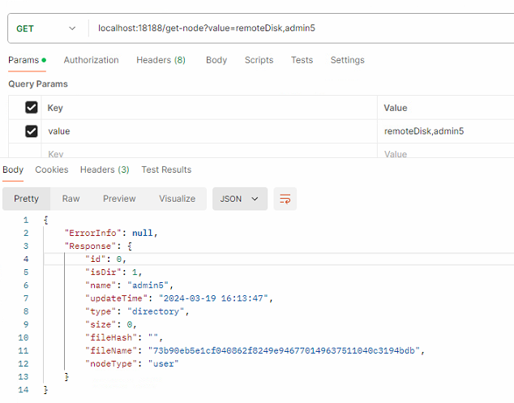
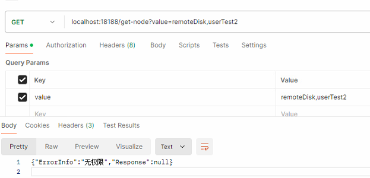

> ## 存储设计说明
```
   对于实际的文件存储结构:
        remoteDisk:
                    租户1：（必填: targetPath下必须指定租户~~~~）
                        file1-name-hash(文件名称是文件的hash值),
                        file2,
                        file3,
                        ...,
                        filen
        blockDisk:（存储还未合并的块数据） 
                    file1-name-hash:
                        hash1,
                        hash2,
                        ...
                    file2: 
                        ...
   文件层级结构:
        只存储对应文件层级结构: 节点名称,节点类型(文件夹/图片/视频...),更新时间,大小(非文件夹)
```

> ## 功能点（[*]代表注册成服务）
 - 上传:
    - /upload(*): [config.ini](config.ini)
      1. 分块上传
      2. 整块上传
   - /upload-succsss(*): 
     1. 上传成功
   - /delete(*)
     1. 删除文件
   - /recover(*)
     1. 恢复已经删除的文件
   - /rename(*)
     1. 修改节点名称
   - /layer-change(*)
     1. 节点层级变换
   - /file-list(*)
     1. 文件列表
   - /cache-list(*)
     1. 回收站当前可回收文件列表
   - /get-preview
     1. 查看预览(支持集合查询)


> ### 节点说明
图数据库中的属性
 
| attribute  |  type | required |                 description                 |
|:----------:|:------:|:--------:|:-------------------------------------------:|
|     id     | int64  |    Y     |                    自带id                     |
|   isDir    |  int8  |    Y     |                是否文件夹: 1是/2不是                |
|    Name    | string |    Y     |              节点名称， 实际的文件(夹)的名称              |
| updateTime | string |    Y     |                    更新时间                     |
|    Type    | string |    N     |                    文件类型                     |
|    Size    | int64  |    N     |                 文件大小(单位:MB)                 |
|  FileHash  | string |    N     |              节点hash值(完整文件的指纹)               |
|  FileName  | string |    Y     |     文件名称（hash值）(用于碰撞处理) -> 用在文件服务的文件名称      |
|  NodeType  | string |    y     | 节点属性(三种身份(root(根节点)/user(租户)/normal(普通节点))) |

> ### server分工
- UploadWholeFiles(上传单个完整文件)
- UploadFileWithDeepPath(前端上传的是文件夹,方法不同点是参数包含了当前文件存储的相对路径)
---
```说明：上传接口，一次调用只能上传一个文件/分块```

> ### ***优化点:***
 - [x] 增加校验（当前租户只能操作所属租户内动的文件）(未完成: 查询也需要校验)
 - [x] 分块上传异步合并: 针对分块文件,后台自主完成合并(rabbitmq+redis)(分块上传成功->记录文件结构->返回成功->异步合并)
 - [x] 快传(相同：分块/文件->二次上传,实现秒传)(minio),对文件秒传的目录允许变动
 - [x] 回滚: 分块(完成合并)/整块(上传成功),才会存储文件层级结构
 - [x] 文件恢复, 支持原结构还原(前提是原始目录同级没有同名的，否则还原失败)
 - [ ] 秒删 + 删除文件后,保存30日
 - [ ] 资源可预览

> ### 接口说明
对于分块接口: 每次接口参数除了FileData 其他都不用变动

- <font color=#0099ff size=3 face="黑体"><u>__接口__: **下载**</u>: /download GET</font>
- `参数说明:`

`header: 需要登录的Authorization （从登录接口中获取）`

|    参数     | 类型 |                                参数说明                                |
|:---------:|:---:|:------------------------------------------------------------------:|
|   path    | string | 用户名以下节点的路径： 例: dir1/dir2/dir3 (需要的是文件夹) / dir1/dir2/file1 （需要的是文件） |

`返回值说明`

|   返回属性    |   类型   |
|:---------:|:------:|
| ErrorInfo | string |
| Response  | zip二进制 |

---
- <font color=#0099ff size=3 face="黑体"><u>__接口__: **上传**</u>: /upload （上传的一定是文件, 途中之前未有的文件夹，会自动创建） GET</font>

- -`参数说明:`

`header: 需要登录的Authorization （从登录接口中获取）`

|      参数      |   类型   | 是否必传 |                                     参数说明                                      |
|:------------:|:------:|:----:|:-----------------------------------------------------------------------------:|
|     file     |  File  | true |                                      文件                                       |
|    isDir     |  int8  | true |                                 是否文件夹: 1是/2不是                                 |
|     name     | string | true |                                     文件名称                                      |
|  updateTime  | string | true |                                     更新时间                                      |
|     type     | string | true |                                     文件类型                                      |
|     size     | int64  | true |                                   文件大小(MB)                                    |
|   fileHash   | string | true |                      文件防碰撞hash值（分块的每一个请求都是同一个filehHash）                       |
|   fileName   | string | true |                              作为节点文件名称，和name一样就行                               |
|  targetPath  | string | true |                             执行下要存储的租户(例如(admin5))                             |
| relativePath | string | true | 租户下面的文件存储路径(例: test0318/test0318Child/${fileName} ps：别忘记最后一个文件名称也要加上，要构成完整路径) |
|   nodeType   | string | true |                          节点类型,待拓展的， 目前默认传入(normal)                            |


---

- <font color=#0099ff size=3 face="黑体"><u>__接口__: **目录新建**</u>(上传的一定是文件夹):  /upload-folder GET</font>

- `参数说明:`

`header: 需要登录的Authorization （从登录接口中获取）`

| 参数 | 类型 |  是否必传 | 参数说明 |
|:--:| :--:| :--:| :--:|
|     file     |  File  | true |                                      文件                                       |
|    isDir     |  int8  | true |                                 是否文件夹: 1是/2不是                                 |
|     name     | string | true |                                     文件名称                                      |
|  updateTime  | string | true |                                     更新时间                                      |
|     type     | string | true |                                     文件类型                                      |
|     size     | int64  | true |                                   文件大小(MB)                                    |
|   fileHash   | string | true |                      文件防碰撞hash值（分块的每一个请求都是同一个filehHash）                       |
|   fileName   | string | true |                              作为节点文件名称，和name一样就行                               |
|  targetPath  | string | true |                             执行下要存储的租户(例如(admin5))                             |
| relativePath | string | true | 租户下面的文件存储路径(例: test0318/test0318Child/${fileName} ps：别忘记最后一个文件名称也要加上，要构成完整路径) |
|   nodeType   | string | true |                          节点类型,待拓展的， 目前默认传入(normal)                            |
_如果是添加租户:（前提必须是管理员账号(default: admin)）_
```json
  {
    "IsDir": 1,
    "Name": "userTest2",
    "Type": "directory",
    "Size": 0,
    "FileName": "userTest2",
    "FileHash": "",
    "TargetPath":"userTest2[指定租户]", 
    "RelativePath":"[这里传空]", 
    "NodeType":"user",
    "UpdateTime": ""
  }
```
_如果是普通添加租户下面的文件夹：只需要登录即可，但只可以编辑自己下面的文件夹, 所以先有账号，才能在这个服务上添加租户(等同于注册)_
```json
     {
      "IsDir": 1,
      "Name": "userTest2",
      "Type": "directory",
      "Size": 0,
      "FileName": "userTest2",
      "FileHash": "",
      "TargetPath":"userTest2[指定租户]",
      "RelativePath":"testFolder1/testFolder2/testFolder3[租户下面的相对路径分割]",
      "NodeType":"user",
      "UpdateTime": ""
    }
```
---

- <font color=#0099ff size=3 face="黑体"><u>__接口__: **获取节点树**</u>(获取节点往下的树):  /get-tree GET</font>
  
- `参数说明:`

`header: 需要登录的Authorization （从登录接口中获取）`

| 参数 |   类型   | 是否必传 |                               参数说明                               |
|:----:|:------:|:----:|:----------------------------------------------------------------:|
|value| string |  是   | 需要查找的树的根节点： fileName（hash值： 这里的hash值由接口get-node提供,防止不同租户之间跨租户访问） |

---

- <font color=#0099ff size=3 face="黑体"><u>__接口__: **获取节点**</u>(获取单节点信息):  /get-node GET</font>
  `参数说明:`

`header: 需要登录的Authorization （从登录接口中获取）`

| 参数 |   类型   | 是否必传 |                         参数说明                          |
|:----:|:------:|:----:|:-----------------------------------------------------:|
|value| string |  是   | 查找的节点路径,起始路径是remoteDisk, 英文逗号分割(例： remoteDisk,admin5) |

查找路径中的租户节点一定需要和token的账户一样： 否则就无权限




