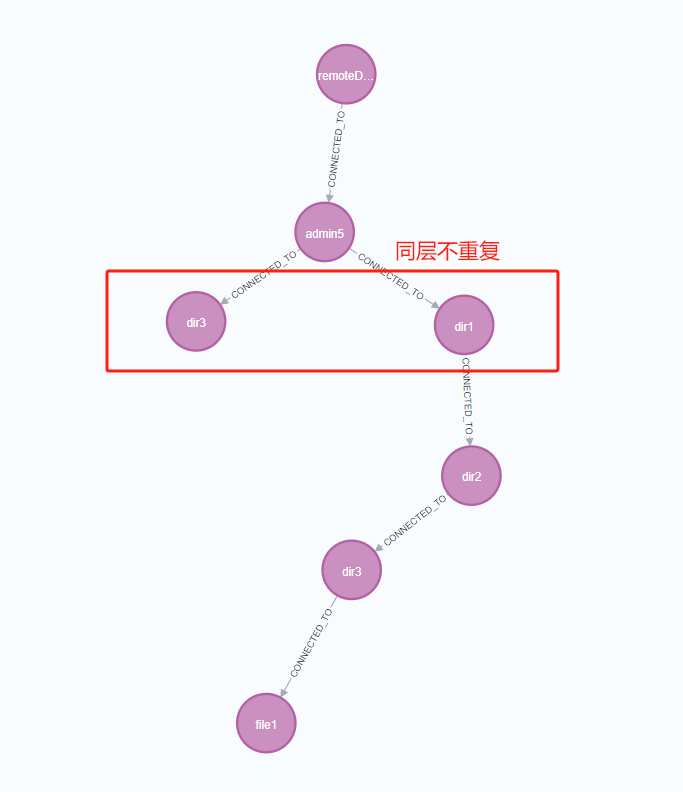
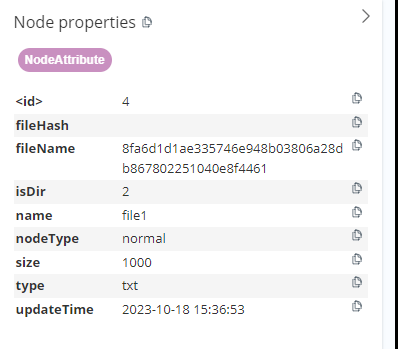
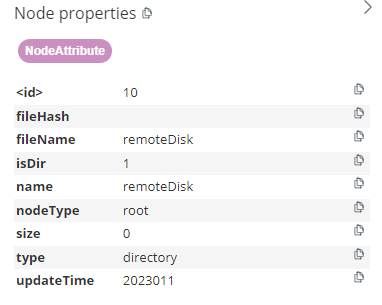
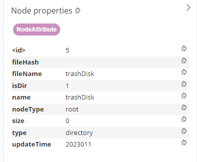

> # NEO4J的一些语法
```
创建节点：
MERGE (g:NodeAttribute {name: 'g'}) （如果存在就会跳过）

建立关系:
MERGE (e)-[:CONNECTED_TO]->(f) 

返回所有从当前节点触发的所有叶子节点路径：
MATCH p=(root:NodeAttribute{name: 'b'})-[:CONNECTED_TO*]->(subtree:NodeAttribute) WHERE NOT (subtree)-[:CONNECTED_TO]->() RETURN p

删除默认节点+关系
MATCH (n)
WHERE id(n) = 4
DETACH DELETE n

MATCH (n:NodeAttribute{name: "g"}) 
DETACH DELETE n

删除关系
MATCH (e:NodeAttribute{name: "e"})-[r:CONNECTED_TO]->(b:NodeAttribute{name: "b"})
DELETE r

通过链路查找节点(前提路径唯一)
MATCH path = (a:NodeAttribute {name: 'a'})-[:CONNECTED_TO]->(b:NodeAttribute {name: 'b'})-[:CONNECTED_TO]->(c:NodeAttribute {name: 'e'})-[:CONNECTED_TO]->(d:NodeAttribute {name: 'f'})
RETURN d

父节点的查找
MATCH (parent)-[:CONNECTED_TO*1]->(child:NodeAttribute{fileName:"xxx"})
RETURN parent

节点向上查找
MATCH (root:NodeAttribute{name:"trashDisk"})-[:CONNECTED_TO]->(a:NodeAttribute {name: "admin2"})
MATCH (b:NodeAttribute {fileName: 'a8a4dfa2a0cd065c6589d3bffcf8b676c3b92507e89644394d'})  // 匹配节点trash dir2
CALL apoc.path.subgraphNodes(b, {
  relationshipFilter: 'CONNECTED_TO<',  // 向上查找关系
  depth: 999  // 设置足够大的深度以确保可以找到a节点
})
YIELD node
WHERE node = a  // 检查是否找到a节点
RETURN a

```

**neo4j(树说明):**
- 有一个根节点
- 租户(第二层子节点)不重复， 都在同一层 （前两层的name是独一无二的， 其他层无法在线）
- 同一层节点之间name不允许重复

> *前三个条件保证路径[节点name1, 节点name2, 节点name3,...]是唯一的，不存在岔路*

>假如当前路径添加的叶子节点存在同名的情况, 不对节点做任何改动，只做文件覆盖


**节点案例:**



**节点属性**



**固定： 根节点**



**固定： 垃圾站 根节点**



